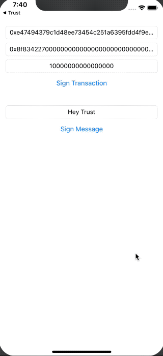
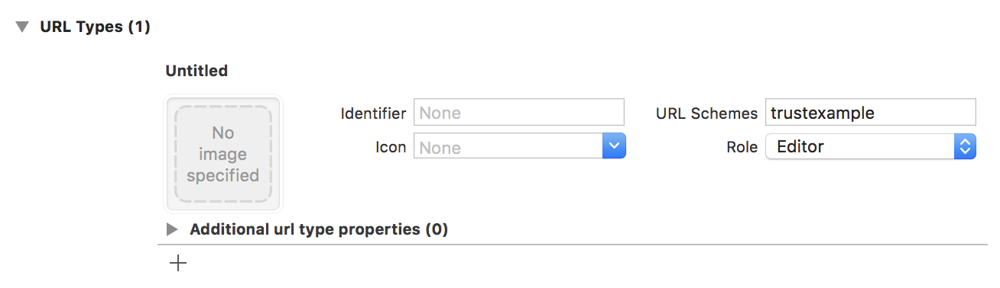

# TrustSDK

[](https://travis-ci.org/TrustWallet/TrustSDK-iOS)
[](https://cocoapods.org/pods/TrustSDK)
[](https://cocoapods.org/pods/TrustSDK)
[](https://cocoapods.org/pods/TrustSDK)

## Getting Started

The TrustSDK lets you sign Ethereum transactions and messages so that you can bulid a native DApp without having to worry about keys or wallets. Follw these instructions to integrate TrustSDK in your native DApp.

## Demo



### Add dependency

TrustSDK is available through [CocoaPods](https://cocoapods.org). To install it, simply add the following line to your Podfile:

```ruby
pod 'TrustSDK'
```

Run `pod install`.

### Register a scheme for your app

Open Xcode an click on your project. Go to the 'Info' tab and expand the 'URL Types' group. Click on the `+` button to add a new scheme. Enter a custom scheme name in 'URL Scemes'.



### Handle Trust callbacks

In your AppDelegate add `import TrustSDK` at the top and add `let trustSDK = TrustSDK(callbackScheme: "trustexample")` within the class definition. Remember to replace `trustexample` with your custom scheme.

Within your ` func application(_ application: UIApplication, didFinishLaunchingWithOptions launchOptions: [UIApplicationLaunchOptionsKey: Any]?) -> Bool` method add this:

```
/// Handle wallet results
if let url = launchOptions?[.url] as? URL {
    return trustSDK.handleCallback(url: url)
}
```

Also implement the `func application(_ app: UIApplication, open url: URL, options: [UIApplicationOpenURLOptionsKey: Any] = [:]) -> Bool` method like this:

```
func application(_ app: UIApplication, open url: URL, options: [UIApplicationOpenURLOptionsKey: Any] = [:]) -> Bool {
    /// Handle wallet results
    return trustSDK.handleCallback(url: url)
}
```

### Sign a transaction

To sign a transaction use this code

```
trustSDK.signTransaction(transaction) { [weak self] signedTransaction in
    // Use signedTransaction
}
```

### Sign a message

To sign a message use this code

```
trustSDK.signMessage(message) { [weak self] signedMessage in
    // Use signedMessage
}
```

### Sign a personal message

To sign a message use this code

```
trustSDK.signPersonalMessage(message) { [weak self] signedMessage in
    // Use signedMessage
}
```

## Example

Trust SDK includes an example project with the above code. To run the example project clone the repo and run `pod install` from the Example directory. Open `TrustSDKExample.xcworkspace` and run. Make sure that you have Trust Wallet installed on the device or simulator to test the full callback flow.


## Authors

* Viktor Radchenko, yazexel@gmail.com
* Alejandro Isaza

## License

TrustSDK is available under the MIT license. See the LICENSE file for more info.
